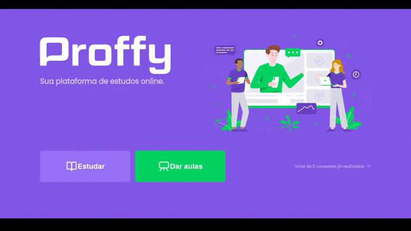
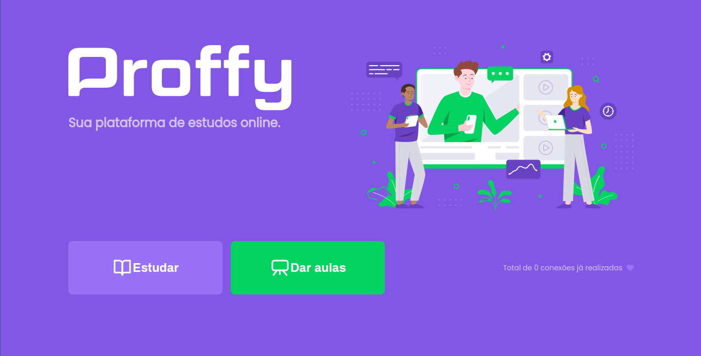
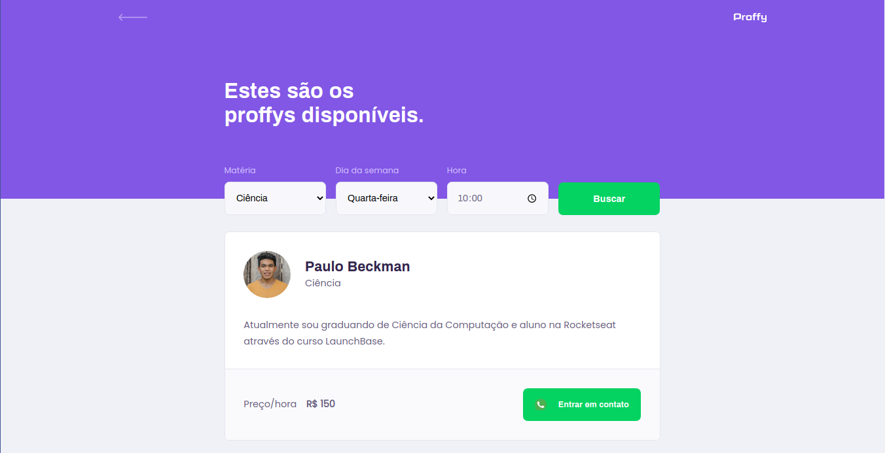
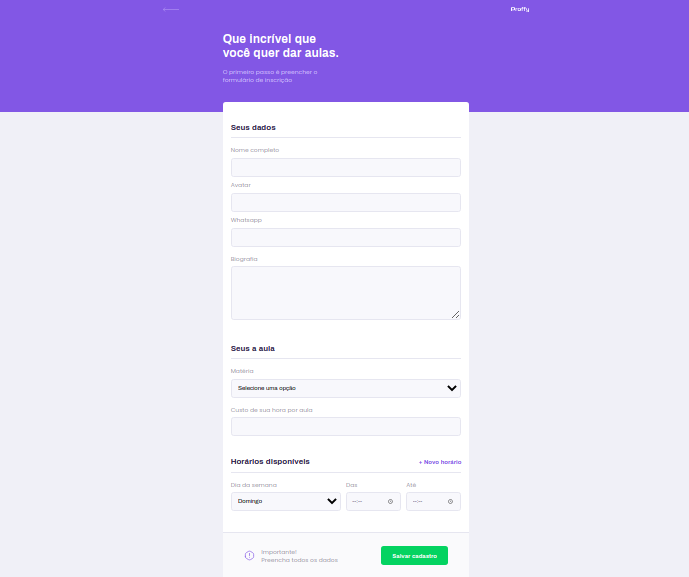
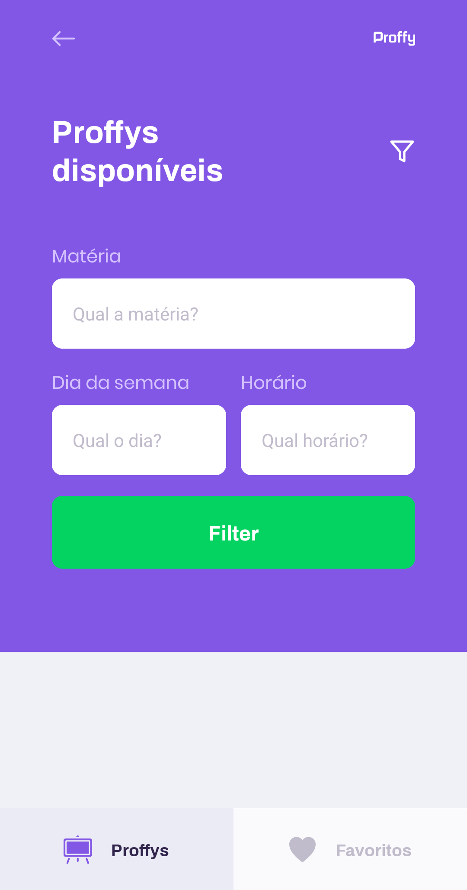

<h1 align="center">
    
</h1>

<h4 align="center"> 
	🚀 NextLevelWeek 2.0 🚀
</h4>
  
<p align="center">
  
  
  
  
  <a href="https://www.linkedin.com/in/paulobeckman/">
    
  </a>
	
  
  <a href="https://github.com/paulobeckman/Proffy/commits/master">
    
  </a>

  
   <a href="https://github.com/paulobeckman/Proffy/stargazers">
    
  </a>
</p>


## 💻 Sobre o projeto

🧑‍🏫Proffy - é uma plataforma que conecta alunos aos professores de diferentes matérias escolares.

Os professores poderão se cadastrar na plataforma web enviando:
- nome
- uma url de imagem dele 
- número de whatasapp
- biografia
- matéria
- custo de sua hora por aula
- horários disponíveis:
  - dia da semana 
  - hora de início
  - hora de termino

Os alunos podem escolher a matéria, dia da semana e hora que desejam estudar e assime entrar em contato com o professor usando o whatsapp.
 
Projeto desenvolvido durante a **NLW2 - Next Level Week 2** oferecida pela [Rocketseat](rs).
O NLW é uma experiência online com muito conteúdo prático, desafios e hacks onde o conteúdo fica disponível durante uma semana.


### Web

<p align="center" style="display: flex; align-items: flex-start; justify-content: center;">
	
  	
		
  

  

  
</p>


### Mobile

<p align="center" style="display: flex; align-items: flex-start; justify-content: center;">
	
  	
		
  

  

  
</p>

## 🛠 Tecnologias

As seguintes ferramentas foram usadas na construção do projeto:

- [Typescript][ts]
- [React][react]
- [Expo][expo]
- [NodeJS][nodejs]
- [CSS][CSS]
- [SQLite3][SQLite]


## 🚀 Como rodar este projeto

Podemos considerar este projeto como sendo divido em duas partes:
1. Back End (pasta server) 
2. Front End (pasta web e mobile)

💡O Front End precisa que o Back End esteja sendo executado para funcionar.

### Pré-requisitos

Antes de começar, você vai precisar ter instalado em sua máquina as seguintes ferramentas:
[Git](https://git-scm.com), [Node.js][nodejs]. 
Além disto é bom ter um editor para trabalhar com o código como [VSCode][vscode]

### 🎲 Rodando o Back End (servidor) e a aplicação web (Front End)

```bash
# Clone o Repositoria
$ git clone https://github.com/paulobeckman/Proffy.git
```

### 📦 Rode a API

```bash
# Vá para a pasta do servidor
$ cd Proffy/server

# Instale as depedencias
$ yarn install

# Rode a aplicação
$ yarn start
```
Acesse a API: http://localhost:3333/

### 💻 Rode o Project Web

```bash
# Vá para a pasta web
$ cd Proffy/web

# Instale as depedencias
$ yarn install

# Rode a aplicação
$ yarn start
```
Acesse: http://localhost:3000/ para ver o resultado.

### 📱 Run Mobile Project
Para rodar o projeto mobile você precisa de um celular com o [expo](https://play.google.com/store/apps/details?id=host.exp.exponent) instlado ou um emulador android/ios.

```bash
# Vá para a pasta mobile
$ cd Proffy/mobile

# Instale as depedencias
$ yarn install

# Rode a aplicação
$ yarn start
```
Depois leia o QRCode com o app do [expo](https://play.google.com/store/apps/details?id=host.exp.exponent) ou rode em um emulador.


## 📝 Licença

Este projeto esta sobe a licença MIT. Veja a [LICENÇA](license) para saber mais.

Feito por Paulo Beckman 👋🏽 [Entre em contato!](https://www.linkedin.com/in/paulo-beckman/)

[nodejs]: https://nodejs.org/
[yarn]: https://yarnpkg.com/
[vscode]: https://code.visualstudio.com/
[license]: https://opensource.org/licenses/MIT
[rs]: https://rocketseat.com.br>
[CSS]: https://developer.mozilla.org/pt-BR/docs/Web/CSS
[SQLite]: https://www.sqlitetutorial.net/sqlite-nodejs/
[ts]: https://www.typescriptlang.org/
[react]: https://reactjs.org/
[expo]: https://expo.io/
